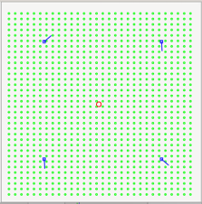
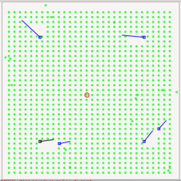
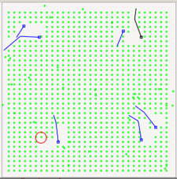
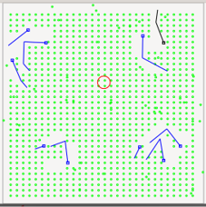

# Microrecif-project

## Overview

Microrécif is a C++ simulation engine modelling the evolution of an artificial ecosystem with corals, algae and scavengers. It was realized for an Object-Oriented programming class at EPFL, in the spring of 2023. in the context of this class, the project was created without AI to understand some key software engineering challenges : 

- modular software architecture
- object-oriented design
- 2D collision detection
- event-driven simulation
- graphical rendering

The ecosystem modelled contains three different types of entities : 
- the algae are represented by green circles. They are randomly generated if the generation is activated, and die after a certain number of steps.
- the corals are represented by blue segments. They are made of different arms, with the last arm that can rotate without colliding with the other corals. This last arm can eat algae if it encounters some. By doing so, it either grows or stops rotating and forms a new arm for the coral. They have a limited lifetime, and when they die, they turn black and stop moving.
- the scavengers are represented by red circles. Their goal is to eat the corals. At each step, they can move towards the body of the closest coral in the simulation. When they reach it, they start eating the coral, following its arms. By eating it, they grow in size and form a new small scavenger when they get too big. They also have a limited lifetime, and die after a certain amount of steps.

The simulation can be started with no input files, or with an input files that determines the entities present at the beginning.

The application includes a GTKmm graphical interface allowing users to visualize the entities and interact with the simulation. The simulation can be done step by step or continuously, with or without random algae generation. The user can also create an output file containing the current simulation state.

The following picture represents four different states of the same simulation, started with an input file :

<table align="center">
  <tr>
    <td align="center">
      
    </td>
    <td align="center">
      
    </td>
  </tr>
  <tr>
    <td align="center">Initial state</td>
    <td align="center">30th update</td>
  </tr>
  <tr>
    <td align="center">
      
    </td>
    <td align="center">
      
    </td>
  </tr>
  <tr>
    <td align="center">60th update</td>
    <td align="center">90th update</td>
  </tr>
</table>

---

## Features

- Object-oriented architecture
- Interactive GUI (GTKmm)
- File import/export
- Simulation loop
- Collision detection
- Segment intersection algorithms
- Dynamic entity management
- Event-driven updates

---

## Software Architecture

The project is organised into different independent modules:

```
  projet
 │     │
GUI    │
│ │    │
│ simulation ───────├
│  │      │         │
│  │    lifeform    │
│  │      │    │    │
│   Message    │    │
│              │    │
│               shape
│                 │
└──────────── graphic

```

This separation makes each module responsible for a single concern and simplifies maintenance and testing.
!!!explanation of each module, in a separate section ?

Simulation : starts by reading the input file if there is one and checks its validity. During the simulation, it handles the updates (movement, birth and death of entities), the drawings of the entities and the writing of output files when required.

Shape : defines all functions related to the geometry of the points, vectors and segments (segments intersection, distance computation, ...)

Message : module in charge of displaying standardized error messages for an incorrect reading of the input files.

---

!!!Explain how to start this project

## Technologies

Language: C++17  
GUI: GTKmm  
Build system: Make  
Paradigms: Object-Oriented Programming, modular design

---

## Skills acquired

This project required implementing:

- software modularity
- simulation architecture
- object interactions
- event handling
- graphical visualization
- testing and debugging of a multi-module application

---

## Build

!!!make better explanations and presentation

```bash
make
```

Run

```bash
./projet example.txt
```

---

## Why this project?

!!!to modify

Although the simulated environment is a coral ecosystem, the software architecture and algorithms are directly applicable to robotics software:

- environment simulation
- geometric reasoning
- collision handling
- modular software development
- event-driven systems
